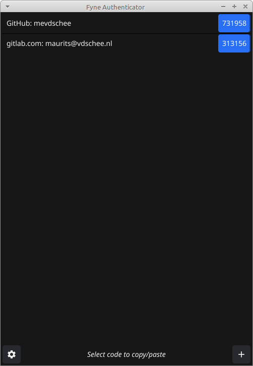
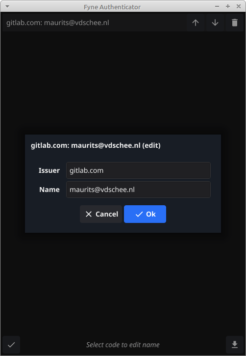
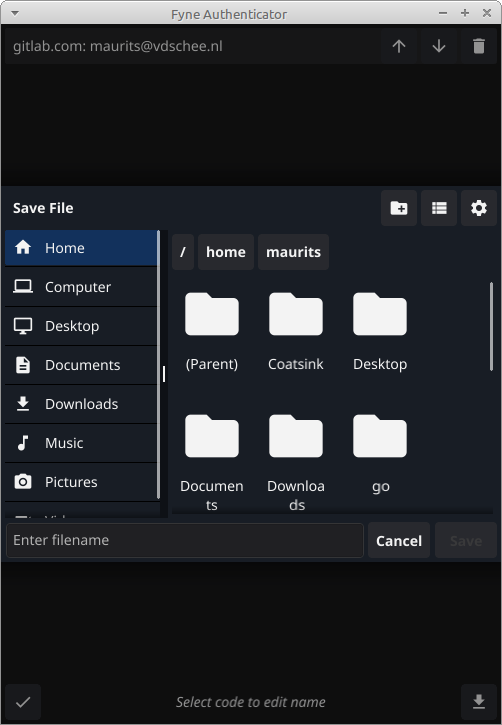

# Fyne Authenticator

> With Fyne Authenticator I don't have to unlock my phone to find a TOTP code. Clicking in the system tray menu copies the latest code to the clipboard. 

Fyne Authenticator is an open source TOTP soft token implementation that is written in Go and uses [Zbar](https://zbar.sourceforge.net/) for QR scanning.

    

### Features

- System tray for quick copy/paste of TOTP code
- Manage your TOTP code list, re-order, rename, etc
- Add by drag and drop or paste of TOTP QR code image
- Add by scanning QR code using webcam (uses Zbar)
- Support of Google Authenticator migration QR codes
- Export all QR codes in a Zip archive as PNG images
- Encrypts TOTP secrets using AES-256-CBC with PBKDF2
- Use keyring to store generated encryption passphrase

### Requirements

Although this application has the potential to run on many platforms it is currently only tested under Debian (based) Linux.

### Install dependencies

    sudo apt install zbar-tools

This command installs the `zbarcam` and `zbarimg` executables on Debian based Linux.

### Building

    sudo apt-get install golang gcc libgl1-mesa-dev xorg-dev libxkbcommon-dev

This command installs the [Fyne build dependencies](https://docs.fyne.io/started/) on Debian (based) Linux.

    go run .

This builds and runs the application.

### Contributing

This project would benefit from: cross platform testing, a cross platform build pipeline and cross platform installers.

Enjoy!
